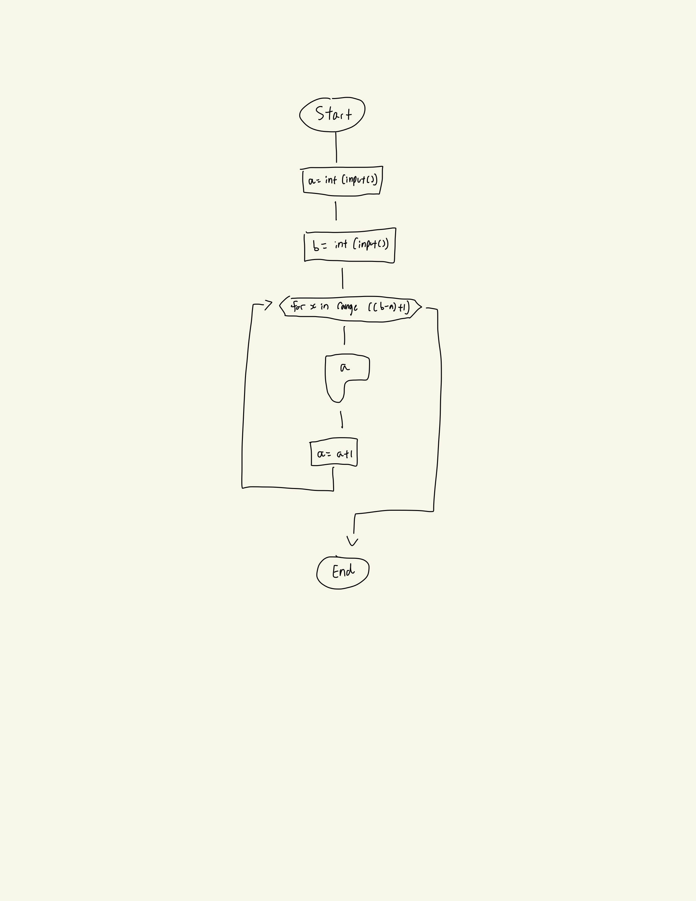
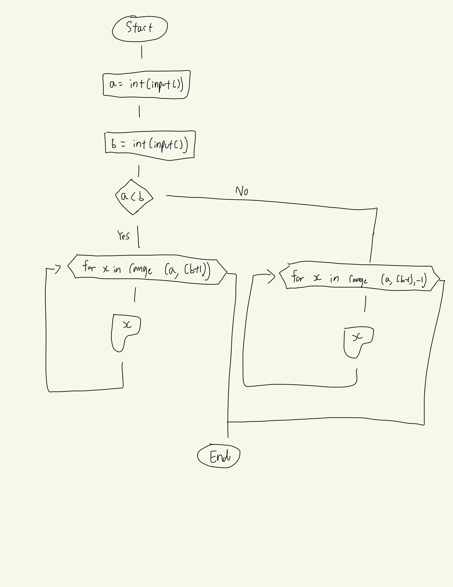
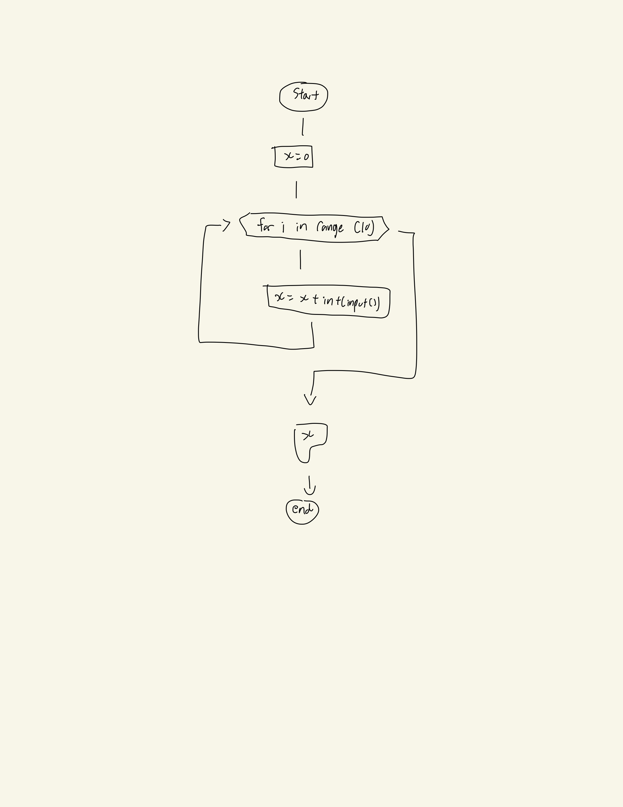
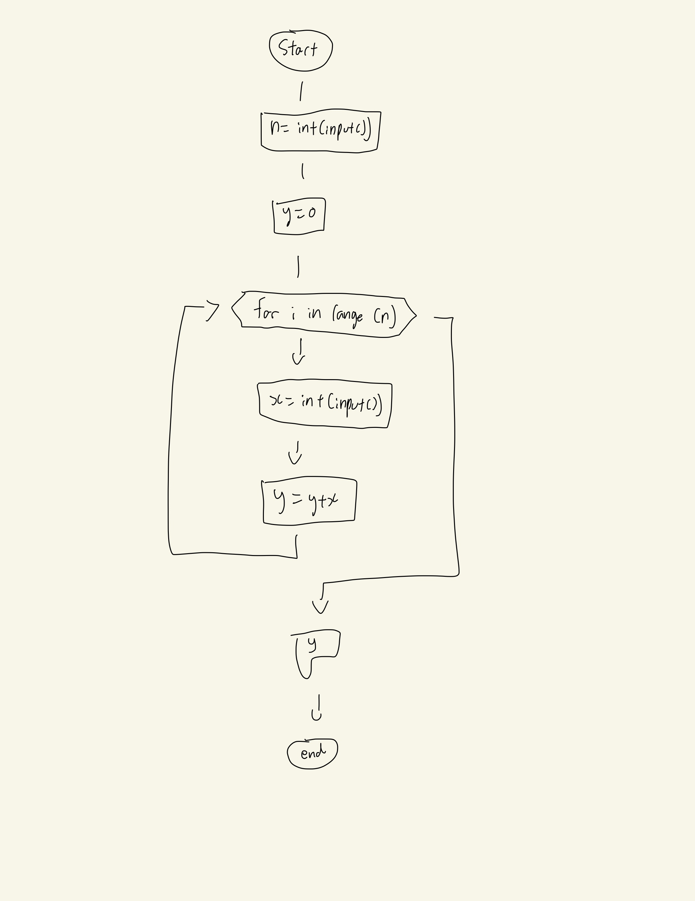
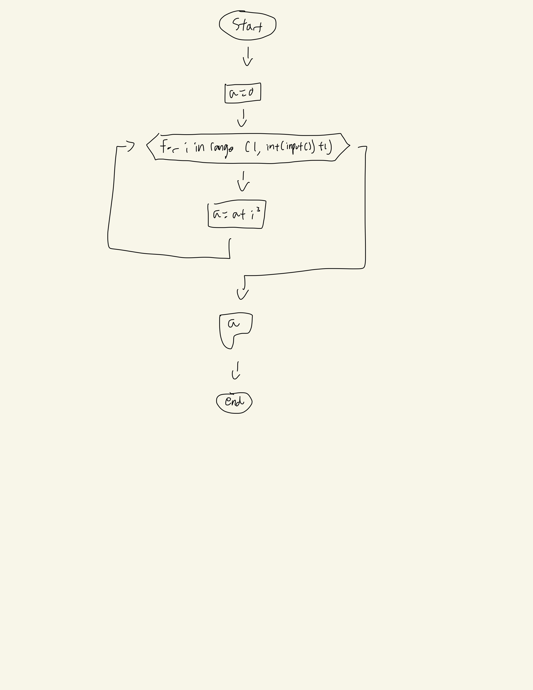
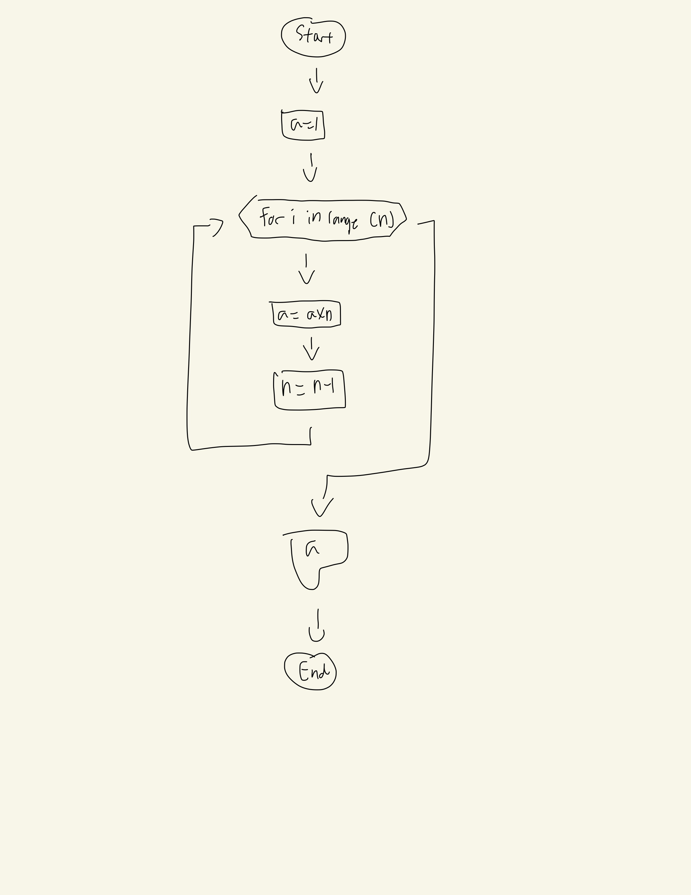
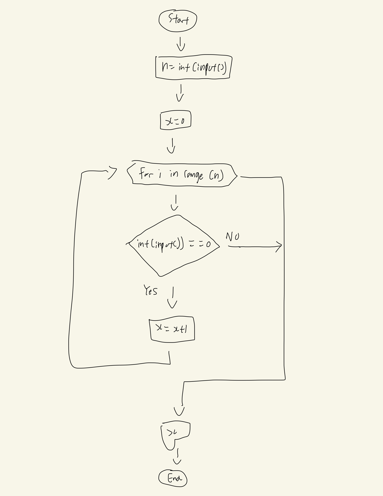

## 1. Series - 1
Given two integers A and B (A ≤ B). Print all numbers from A to B inclusively.

```.py
#Gather user input
a=int(input())
b=int(input())
#For loop to print all values in order
for x in range((b-a)+1):
    print(a)
    a+=1
```


## 2. Series - 2
Given two integers A and B. Print all numbers from A to B inclusively, in ascending order, if A < B, or in descending order, if A ≥ B.

```.py
#Get user input
a=int(input("What is your a? > "))
b=int(input("What is your b? > "))
#If b is bigger than a, print a to b in steps of +1
if a<b:
    for x in range (a,(b+1)):
        print(x)
#Else print a to b in steps of -1
else:
    for x in range (a,(b-1),-1):
        print(x)
```


## 3. Sum of ten numbers
10 numbers are given in the input. Read them and print their sum. Use as few variables as you can.

```.py
# Set placeholder (x) value as 0
x = 0
#Repeat 10 times with range 10
for i in range(10):
    x += int(input())
#Print results (x)
print(x)
```


## 4. Sum of N numbers
N numbers are given in the input. Read them and print their sum.

The first line of input contains the integer N, which is the number of integers to follow. Each of the next N lines contains one integer. Print the sum of these N integers.

```.py
# get Nth term by determine the interger value of the input
n=int(input())
# Set placeholder (y) as 0
y=0
# Repeat the for loop in factors of N
for i in range (n):
    x=int(input())
    y+=x
# Print results (y)
print(y)
```


## 5. Sum of cubes
For the given integer N calculate the following sum:
1^3+2^3+…+N^3

```.py
# Set place holder (a) as 0
a = 0
# Loop for however many values the user has inputed 
for i in range(1, int(input()) + 1):
    a += i ** 3
# Print results (a)
print(a)
```


## 6. Factorial
In mathematics, the factorial of an integer n, denoted by n! is the following product:
n!=1×2×…×n
For the given integer n calculate the value n!. Don't use math module in this exercise.

```.py
# Set n value as interger of input
n=int(input())
# Set place holder (a) as 1
a=1
# Loop for the Nth value
for i in range (n):
    a*=n
    n-=1
# Print results (a)
print(a)
```


## 7. The number of zeros
Given N numbers: the first number in the input is N, after that N integers are given. Count the number of zeros among the given integers and print it.
You need to count the number of numbers that are equal to zero, not the number of zero digits.

```.py
# Determine Nth value by interger of input
n=int(input())
# Set placeholder (x) as 0
x=0
# Loop for Nth term
for i in range (n):
    if int(input())==0:
        x+=1
# Print results (x)
print(x)
```

