## Minimum of two numbers
Given two integers, print the smaller value.

```.py
#Get input of two values (a,b)
a = int(input("What is your first value? > "))
b = int(input("What is your second value? > "))

#If b is bigger than a then print a, otherwise print b
if a < b:
    print (a)
else:
    print (b)
```
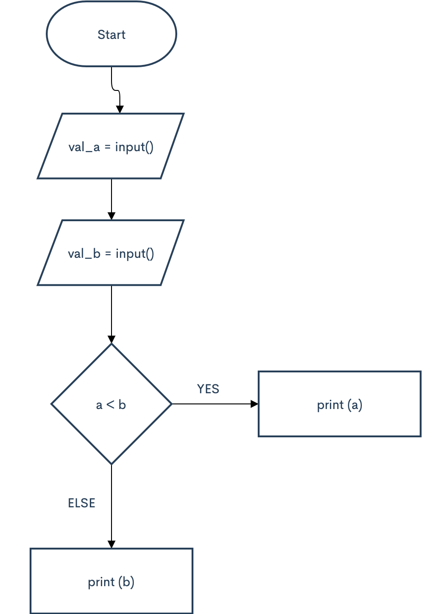

## Sign functions
For the given integer X print 1 if it's positive, -1 if it's negative, or 0 if it's equal to zero.
Try to use the cascade if-elif-else for it.

```.py
# Identify users input
a=int(input("What is your number? > "))

# If input is bigger than 0 print 1
if a > 0:
    print("1")
    
# If input is equal to 0
elif a == 0:
    print("0")
    
# Otherwise print -1 (bcs its a negative number)
else:
    print("-1")
```
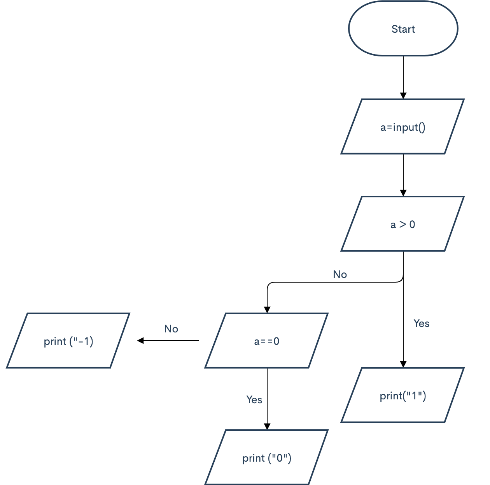

## Minimum of three numbers
Given three integers, print the smallest value.

```.py
a = int(input("What is your first value? > "))
b = int(input("What is your second value? > "))
c = int(input("What is your third value? > "))
if a<b and a<c:
    print (a)
if b<a and b<c:
    print(b)
if c<a and c<b:
    print (c)
```
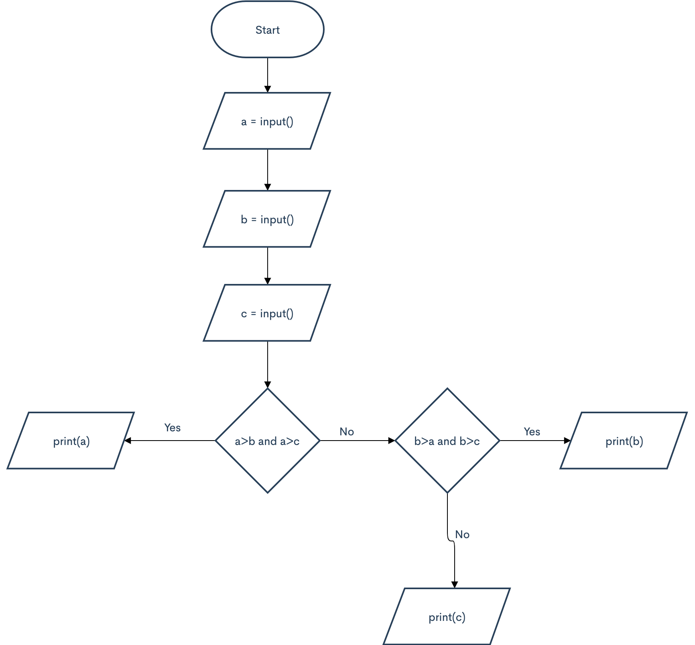

## Equal Numbers
Given three integers, determine how many of them are equal to each other. The program must print one of these numbers: 3 (if all are the same), 2 (if two of them are equal to each other and the third is different) or 0 (if all numbers are different).

```.py
a = int(input())
b = int(input())
c = int(input())

if a == b and b == c:
    print ("3")
elif a == b:
    print ("2")
elif b==c:
    print("2")
elif a==c:
    print("2")
else:
    print("0")
```
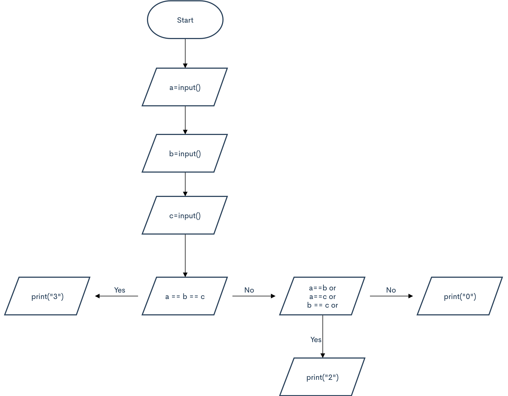

## Rook move
Chess rook moves horizontally or vertically. Given two different cells of the chessboard, determine whether a rook can go from the first cell to the second in one move.
The program receives the input of four numbers from 1 to 8, each specifying the column and row number, first two - for the first cell, and then the last two - for the second cell. The program should output YES if a rook can go from the first cell to the second in one move, or NO otherwise.

```.py
a= int(input())
b= int(input())
c= int(input())
d= int(input())

if a==c or b==d:
    print("YES")
else:
    print("NO")
```
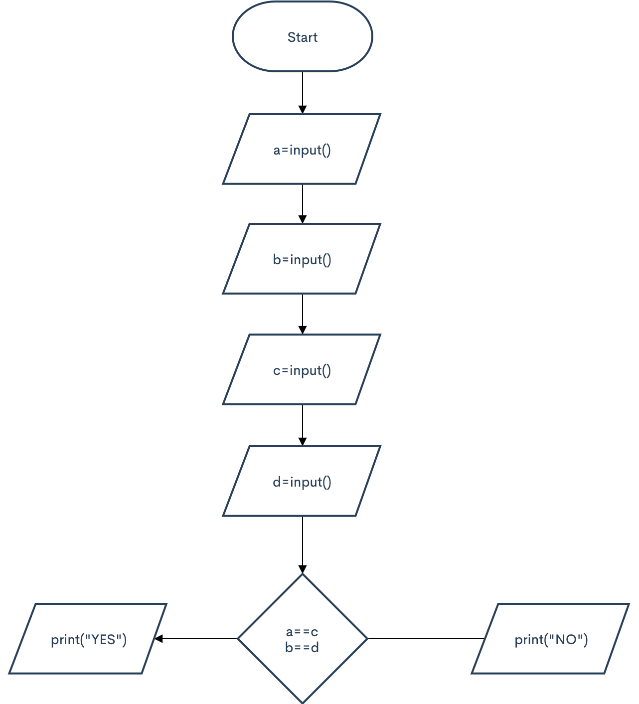

## Chess board - Same color 
Given two cells of a chessboard. If they are painted in one color, print the word YES, and if in a different color - NO.
The program receives the input of four numbers from 1 to 8, each specifying the column and row number, first two - for the first cell, and then the last two - for the second cell.

```.py
a=int(input())
b=int(input())
c=int(input())
d=int(input())

if ((a+b+c+d)%2) == 0:
    print("YES")
else:
    print("NO")
```
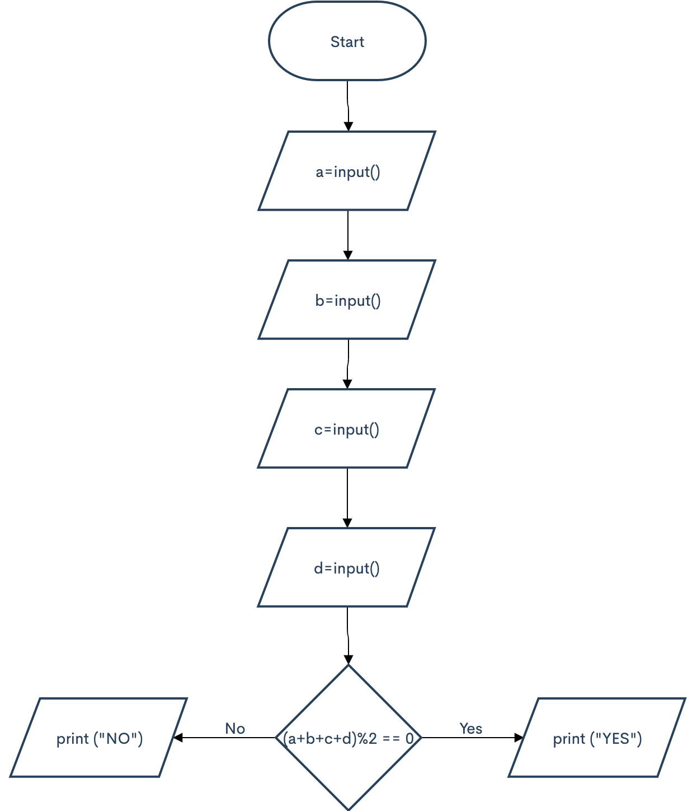

## King move
Chess king moves horizontally, vertically or diagonally to any adjacent cell. Given two different cells of the chessboard, determine whether a king can go from the first cell to the second in one move.
The program receives the input of four numbers from 1 to 8, each specifying the column and row number, first two - for the first cell, and then the last two - for the second cell. The program should output YES if a king can go from the first cell to the second in one move, or NO otherwise.

```.py
a=int(input())
b=int(input())
c=int(input())
d=int(input())
if -1<=(a-c)<=1 and -1<=(b-d)<=1:
    print("YES")
else:
    print("NO")
```
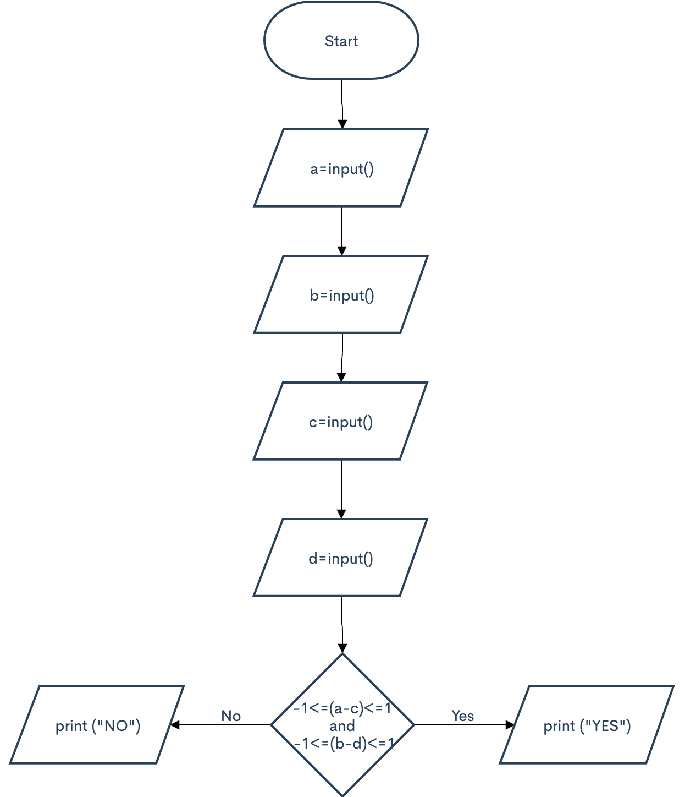

## Bishop move
In chess, the bishop moves diagonally, any number of squares. Given two different squares of the chessboard, determine whether a bishop can go from the first to the second in one move.
The program receives as input four numbers from 1 to 8, specifying the column and row numbers of the starting square and the column and row numbers of the ending square. The program should output YES if a Bishop can go from the first square to the second in one move, or NO otherwise.

```.py

```
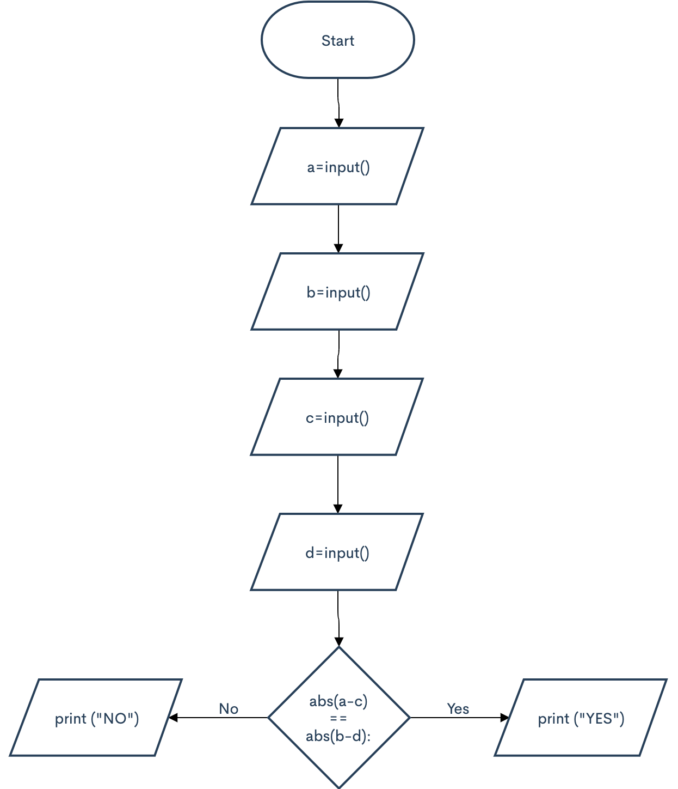
## Queen move
Chess queen moves horizontally, vertically or diagonally to any number of cells. Given two different cells of the chessboard, determine whether a queen can go from the first cell to the second in one move.
The program receives the input of four numbers from 1 to 8, each specifying the column and row number, first two - for the first cell, and then the last two - for the second cell. The program should output YES if a queen can go from the first cell to the second in one move, or NO otherwise.

```.py

```

## Knight move
Chess knight moves like the letter L. It can move two cells horizontally and one cell vertically, or two cells vertically and one cells horizontally. Given two different cells of the chessboard, determine whether a knight can go from the first cell to the second in one move.
The program receives the input of four numbers from 1 to 8, each specifying the column and row number, first two - for the first cell, and then the last two - for the second cell. The program should output YES if a knight can go from the first cell to the second in one move, or NO otherwise.

```.py

```
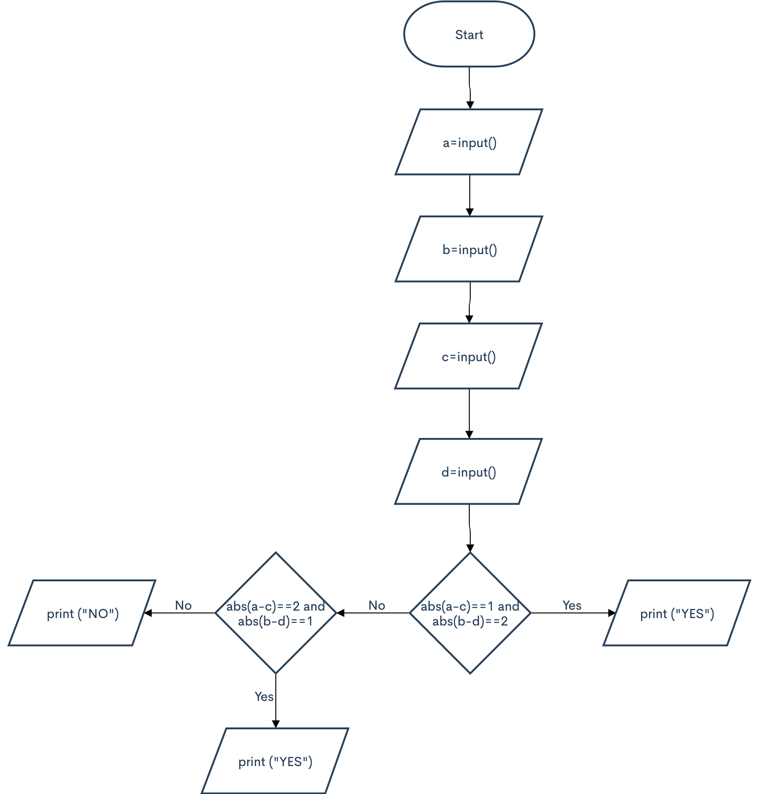
## Chocolate bar
Chocolate bar has the form of a rectangle divided into n×m portions. Chocolate bar can be split into two rectangular parts by breaking it along a selected straight line on its pattern. Determine whether it is possible to split it so that one of the parts will have exactly k squares.
The program reads three integers: n, m, and k. It should print YES or NO.

```.py

```
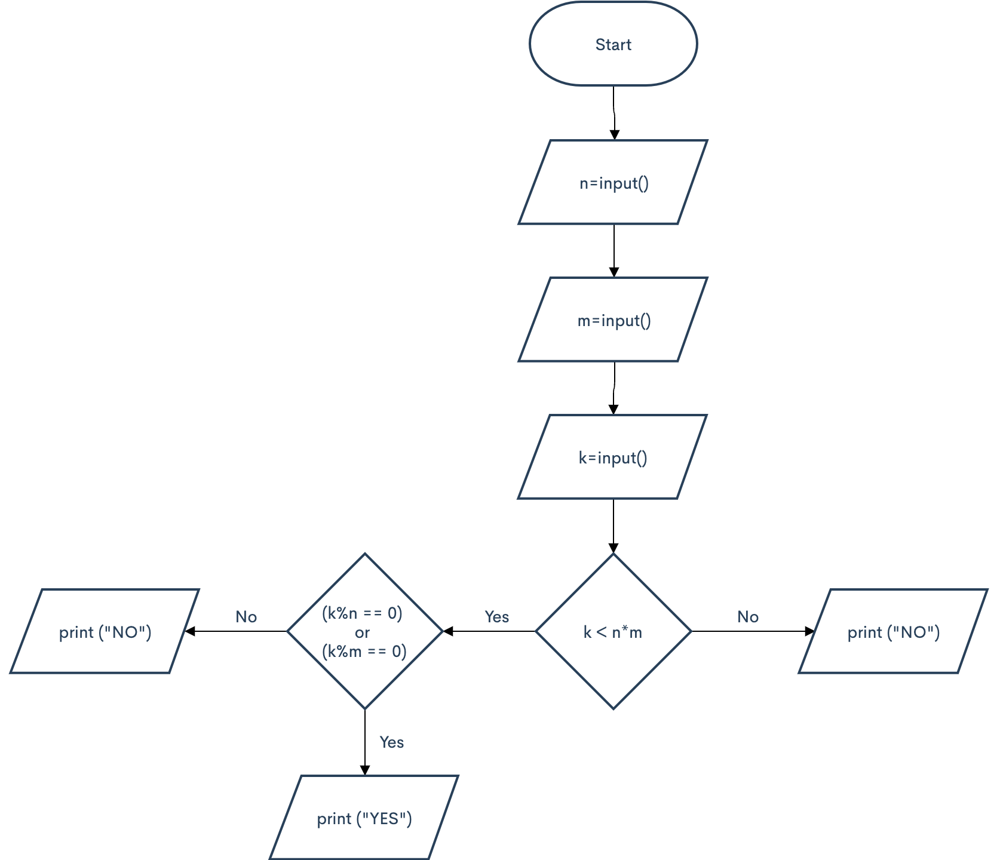
## Leap year
Given the year number. You need to check if this year is a leap year. If it is, print LEAP, otherwise print COMMON.
The rules in Gregorian calendar are as follows:

a year is a leap year if its number is exactly divisible by 4 and is not exactly divisible by 100
a year is always a leap year if its number is exactly divisible by 400
Warning. The words LEAP and COMMON should be printed all caps.

```.py

```
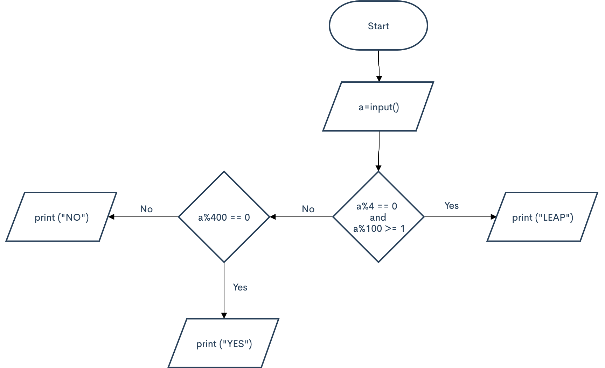
