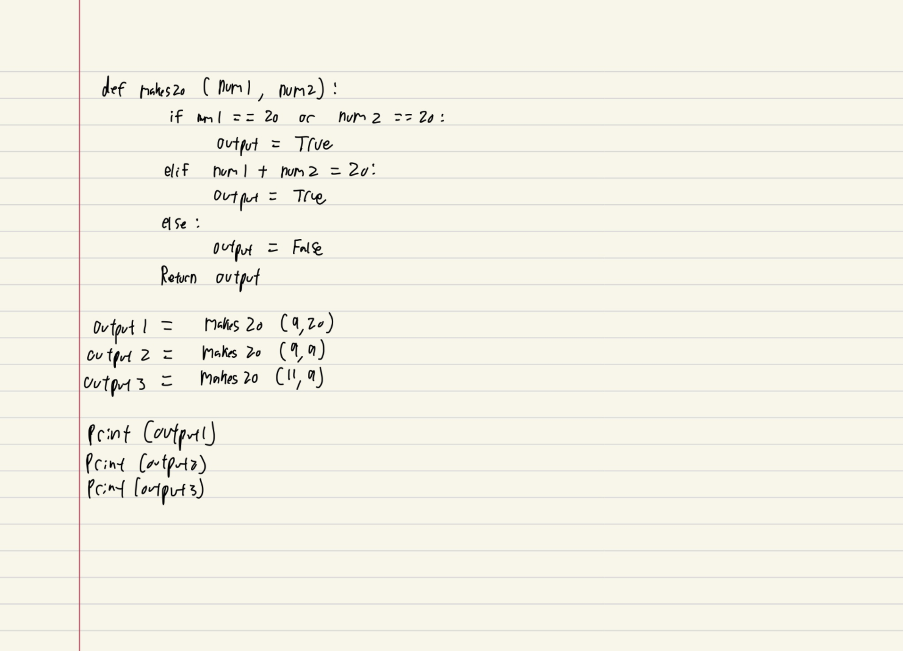
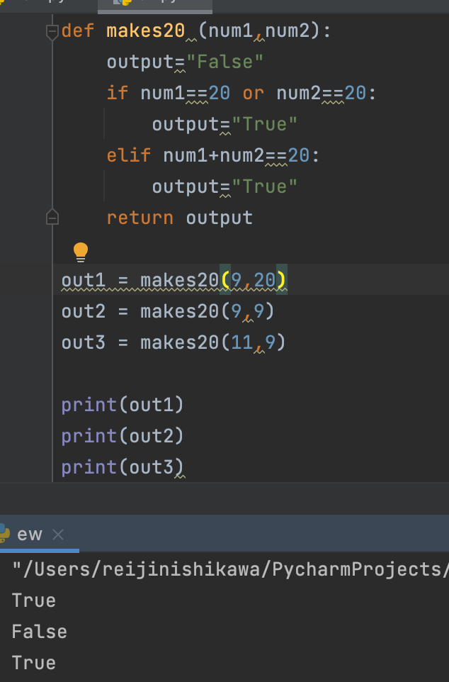

## Given 2 numbers, A and B, Output TRUE if one of them is 20 or if their sum is 20.

# Quiz Number 1


```.py
def makes20 (num1,num2):
    output="False"
    if num1==20 or num2==20:
        output="True"
    elif num1+num2==20:
        output="True"
    return output

out1 = makes20(9,20)
out2 = makes20(9,9)
out3 = makes20(11,9)

print(out1)
print(out2)
print(out3)
```
## Output:


## Flowchart:

