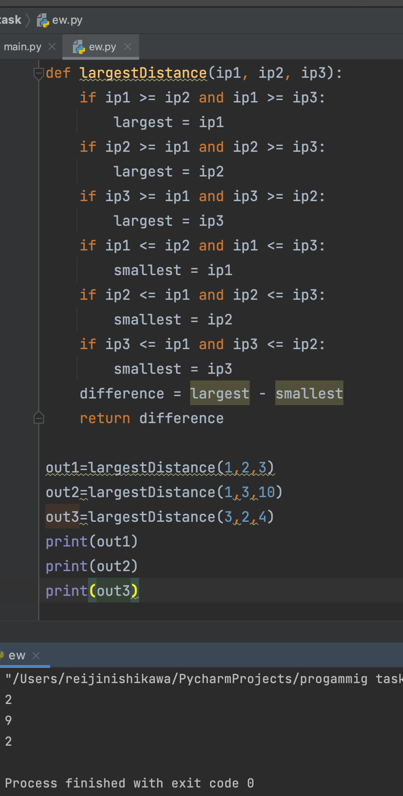
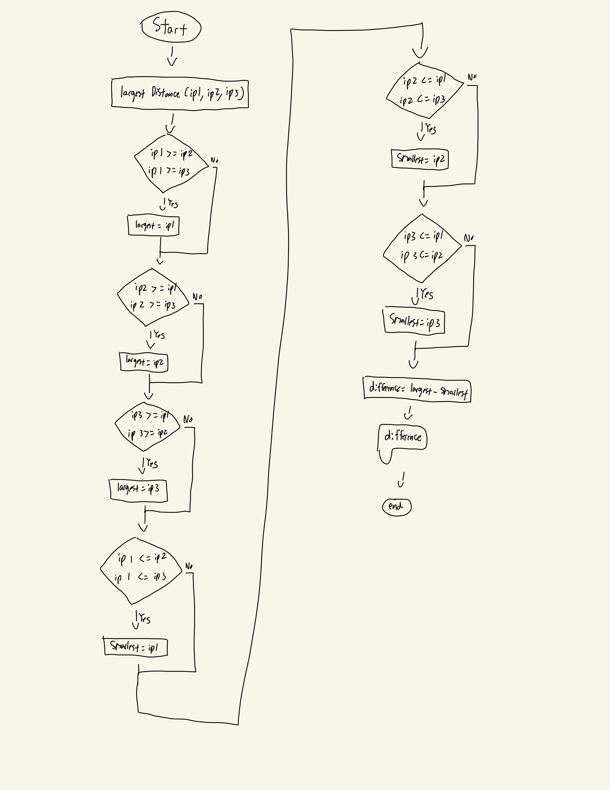

## Given three integer values, A, B, and C, output the largest difference between any of the numbers.

```.py
def largestDistance(ip1, ip2, ip3):
    if ip1 >= ip2 and ip1 >= ip3:
        largest = ip1
    if ip2 >= ip1 and ip2 >= ip3:
        largest = ip2
    if ip3 >= ip1 and ip3 >= ip2:
        largest = ip3
    if ip1 <= ip2 and ip1 <= ip3:
        smallest = ip1
    if ip2 <= ip1 and ip2 <= ip3:
        smallest = ip2
    if ip3 <= ip1 and ip3 <= ip2:
        smallest = ip3
    difference = largest - smallest
    return difference

out1=largestDistance(1,2,3)
out2=largestDistance(1,3,10)
out3=largestDistance(3,2,4)
print(out1)
print(out2)
print(out3)
```
## Output:


## Flowchart:

