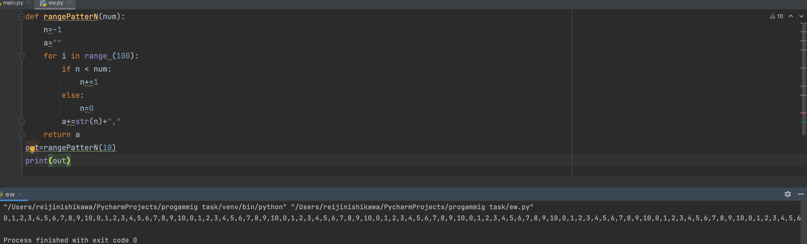

# Quiz 3
## Given an integer N, show 100 integers with the repeating pattern 0 to N-1, 0 to N-1,... 

```.py
def rangePatterN(num):
    n=-1
    out=""
    for i in range (100):
        if n < num:
            n+=1
        else:
            n=0
        out+=str(n)+","
    return out
out=rangePatterN(10)
print(out)
```

## Output:


## Flowchart:

