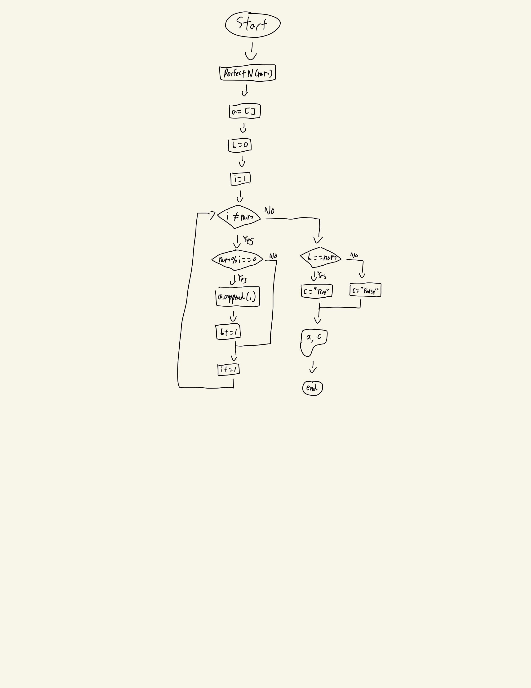

# Quiz 004
## Write a function that receives an integer N, and returns all its factors. 

```.py
def perfectN(num):
    a=[]
    b=0
    i=1
    while i!=num:
        if num%i==0:
            a.append(i)
            b+=i
        i+=1
    if b==num:
        c="True"
    else:
        c="False"
    return a, c
out=perfectN(6)
print(out)
```

## Output: 


## Flowchart:

