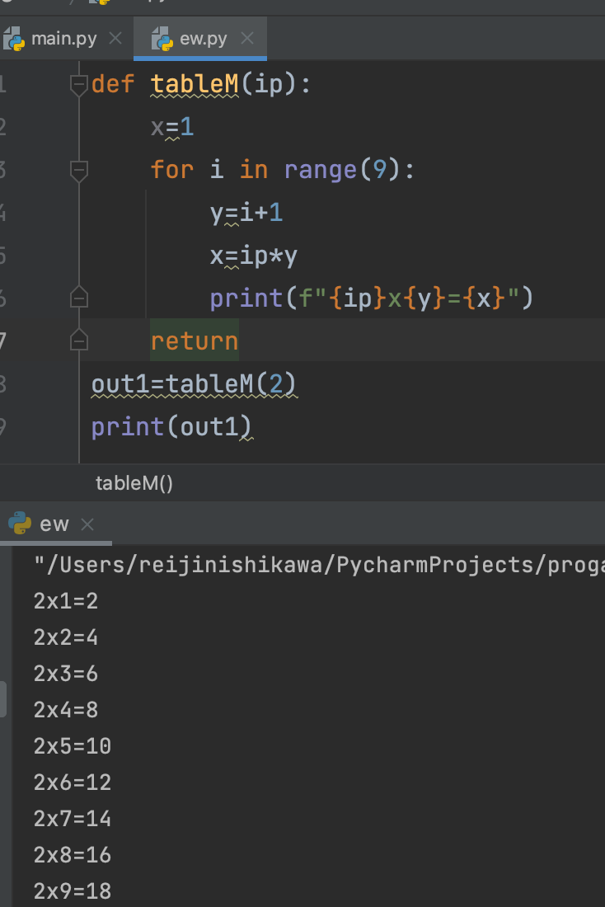
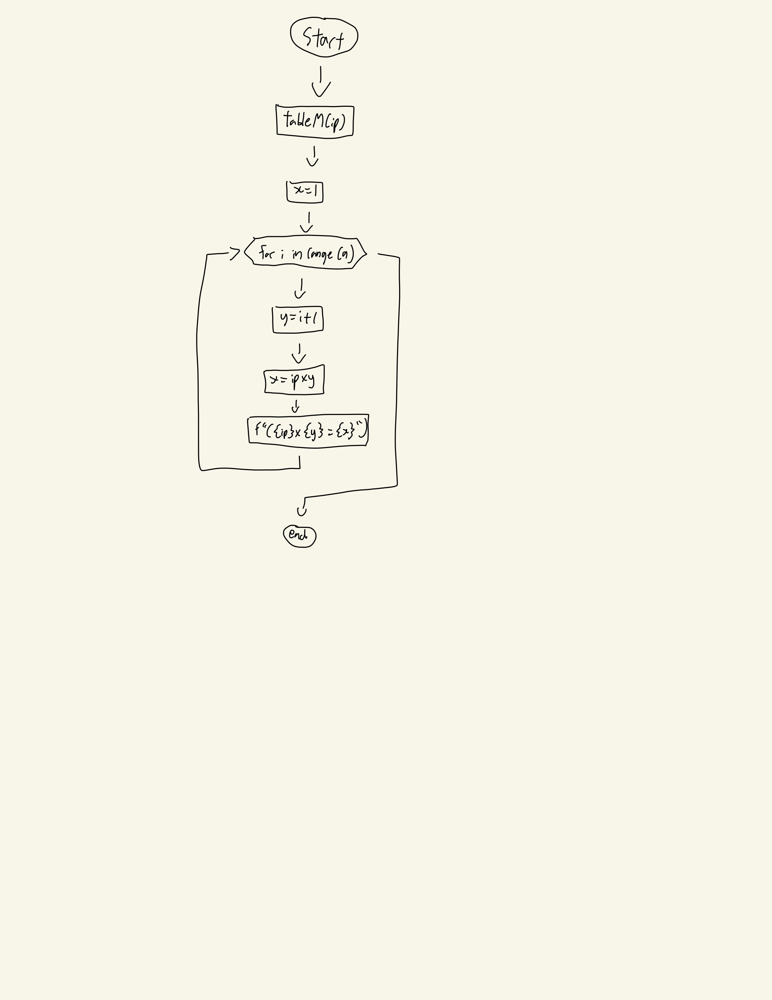

## Given an integer N, show the multiplication table. 

```.py
def tableM(ip):
    x=1
    for i in range(9):
        y=i+1
        x=ip*y
        print(f"{ip}x{y}={x}")
    return
```

## Output:


## Flowchart:

