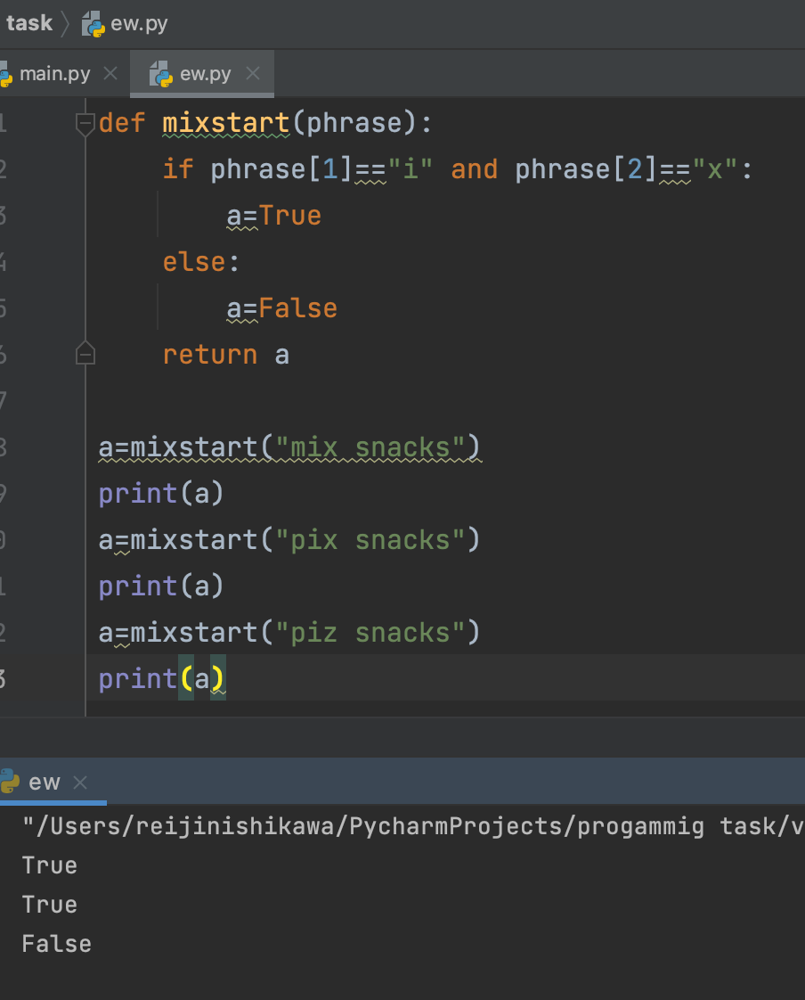
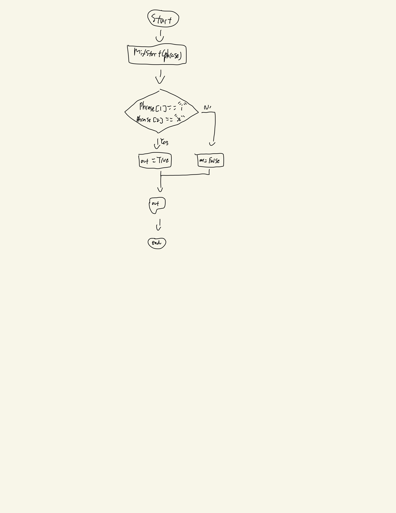

# Quiz 006
## Output TRUE if the given string begins with 'mix', except the 'm' can be anything, so 'pix', '9ix'..., all count.


```.py
def mixstart(phrase):
    if phrase[1]=="i" and phrase[2]=="x":
        a=True
    else:
        a=False
    return a

a=mixstart("mix snacks")
print(a)
a=mixstart("pix snacks")
print(a)
a=mixstart("piz snacks")
print(a)
```
## Output:


## Flowchart:

