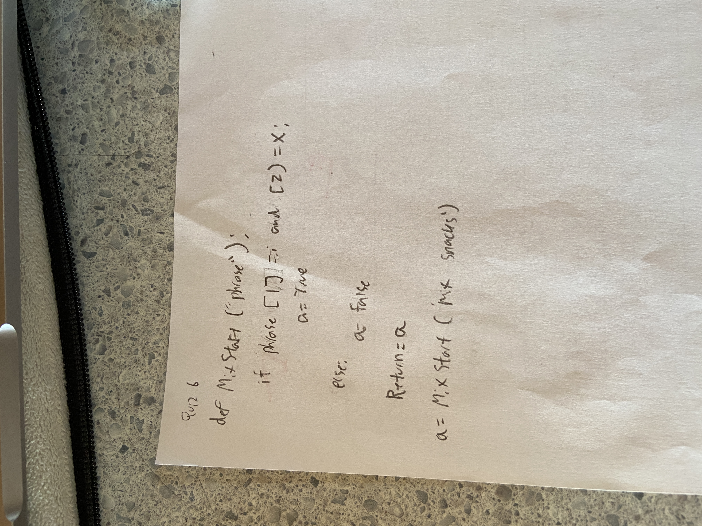

# Quiz 006



```.py
def mixstart(phrase):
    if phrase[1]=="i" and phrase[2]=="x":
        a=True
    else:
        a=False
    return a

a=mixstart("mix snacks")
print(a)
a=mixstart("pix snacks")
print(a)
a=mixstart("piz snacks")
print(a)
```

output:
True
True
False
