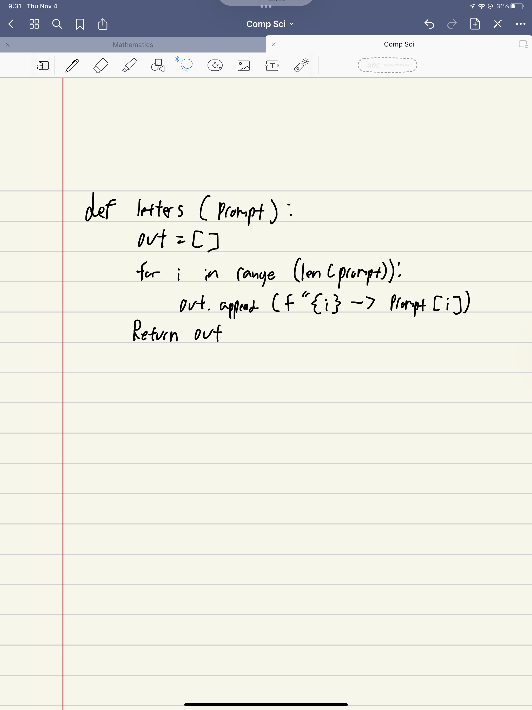

```.py
def letters(prompt):
    out=[]
    for i in range (len(prompt)):
        out.append(f"{i} --> {prompt[i]}")
    return out

out=letters("hello")
print(out)
```

output:
['0 --> h', '1 --> e', '2 --> l', '3 --> l', '4 --> o']
