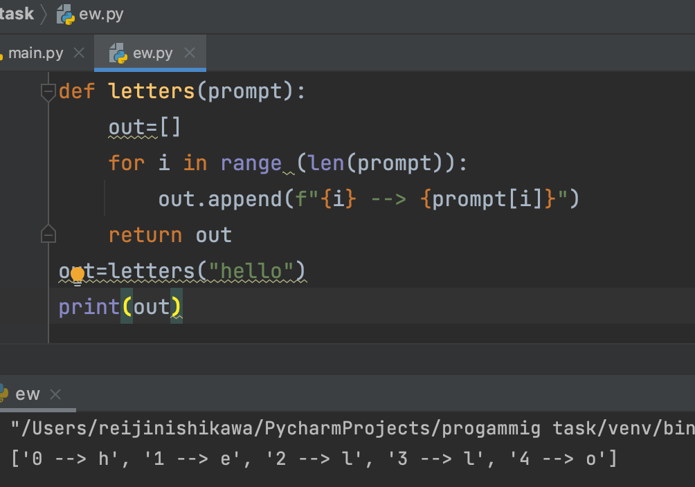

## Given a string, create a function that outputs each letter with its index:


```.py
def letters(prompt):
    out=[]
    for i in range (len(prompt)):
        out.append(f"{i} --> {prompt[i]}")
    return out

out=letters("hello")
print(out)
```


