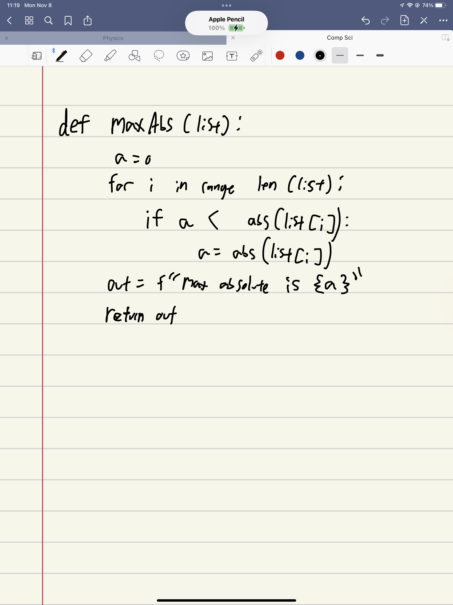
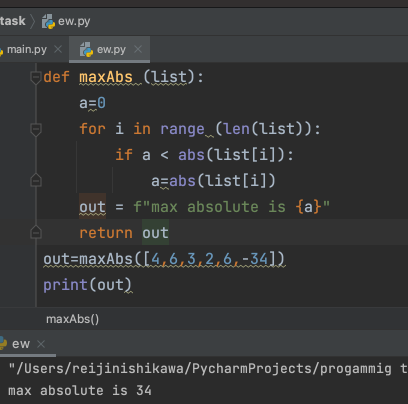
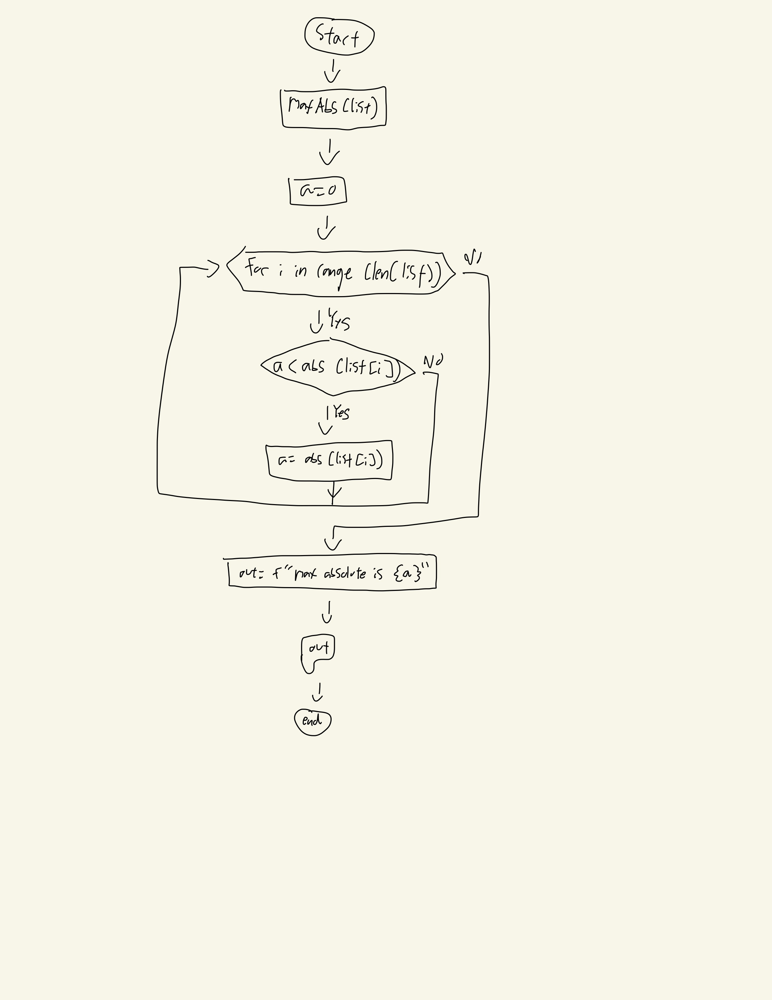

```.py
def maxAbs (list):
    a=0
    for i in range (len(list)):
        if a < abs(list[i]):
            a=abs(list[i])
    out = f"max absolute is {a}"
    return out

o=maxAbs([4,6,3,2,6,-34])
print(o)
```
## output:



## flow chart:


