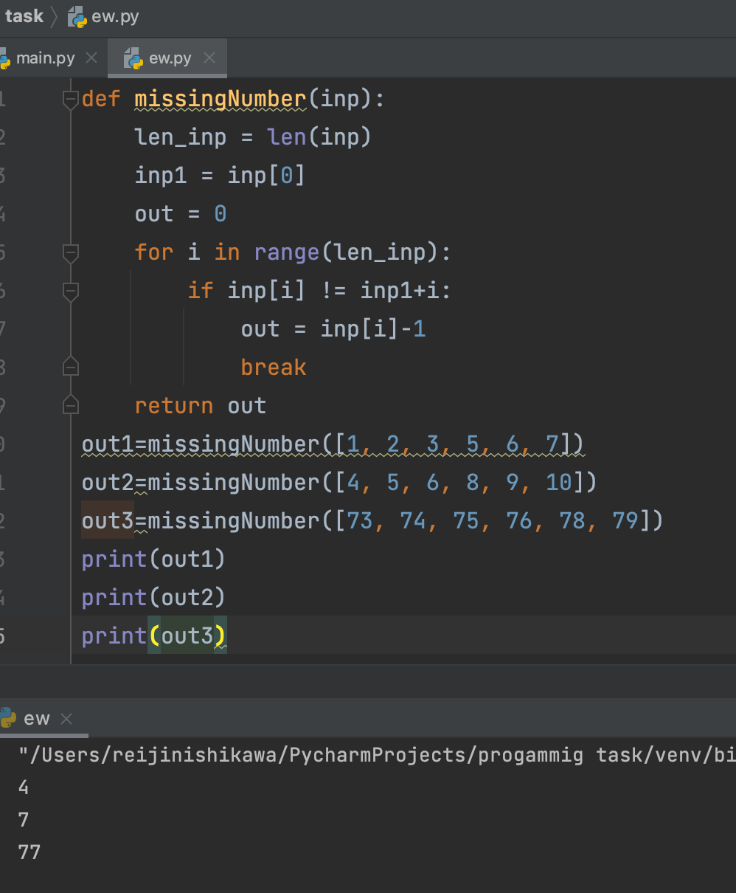

## Given an array of sorted integers, find the missing number.

```.py
def missingNumber(inp):
    len_inp = len(inp)
    inp1 = inp[0]
    out = 0
    for i in range(len_inp):
        if inp[i] != inp1+i:
            out = inp[i]-1
            break
    return out
```

## output:


## Flowchart:


