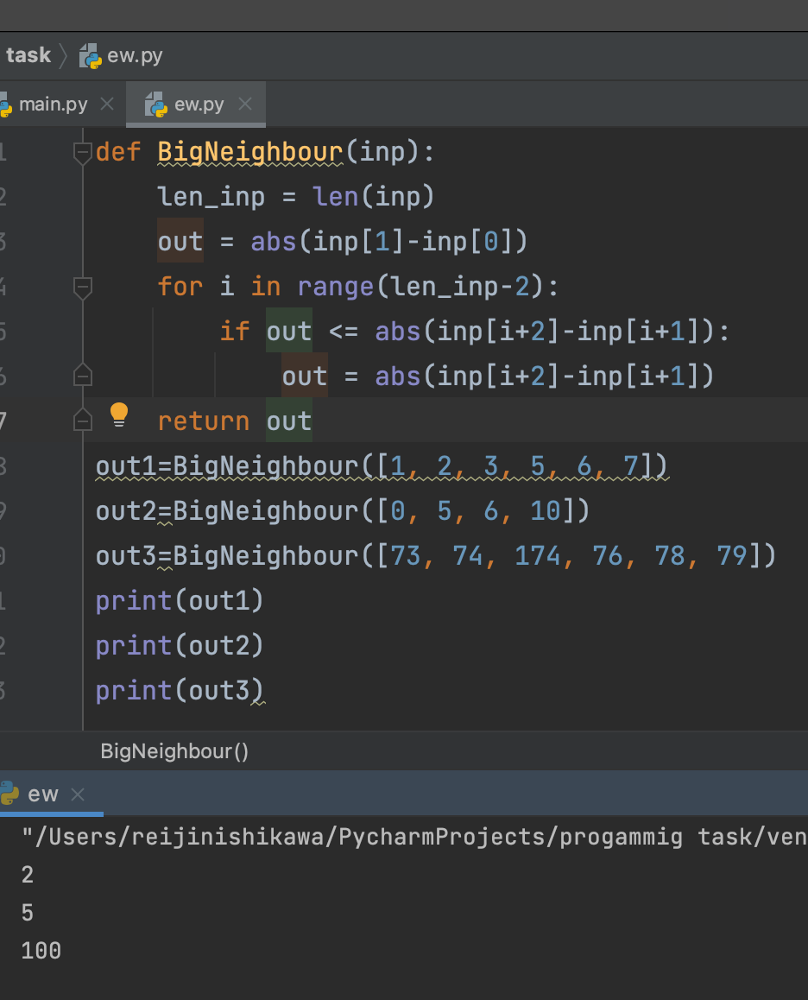

## Given an array of sorted integers, find the largest difference between neighbouring numbers.

```.py
def BigNeighbour(inp):
    len_inp = len(inp)
    out = abs(inp[1]-inp[0])
    for i in range(len_inp-2):
        if out <= abs(inp[i+2]-inp[i+1]):
            out = abs(inp[i+2]-inp[i+1])
    return out
```

## Output:


## Flowchart:

