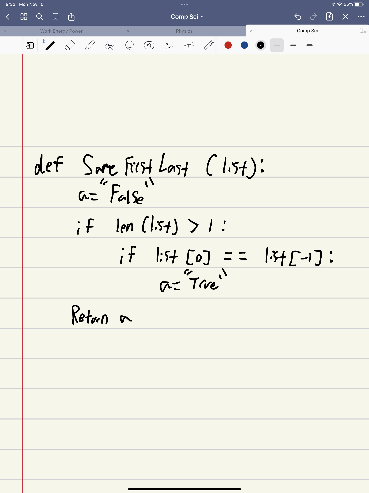
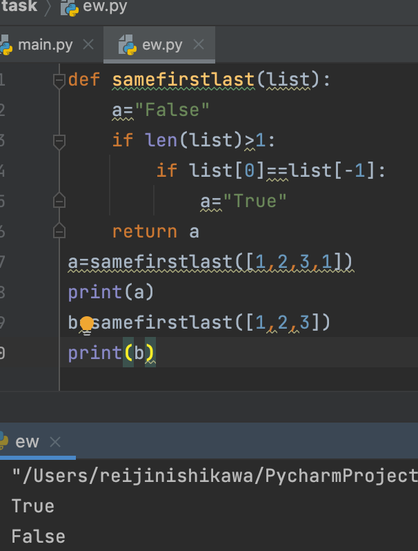
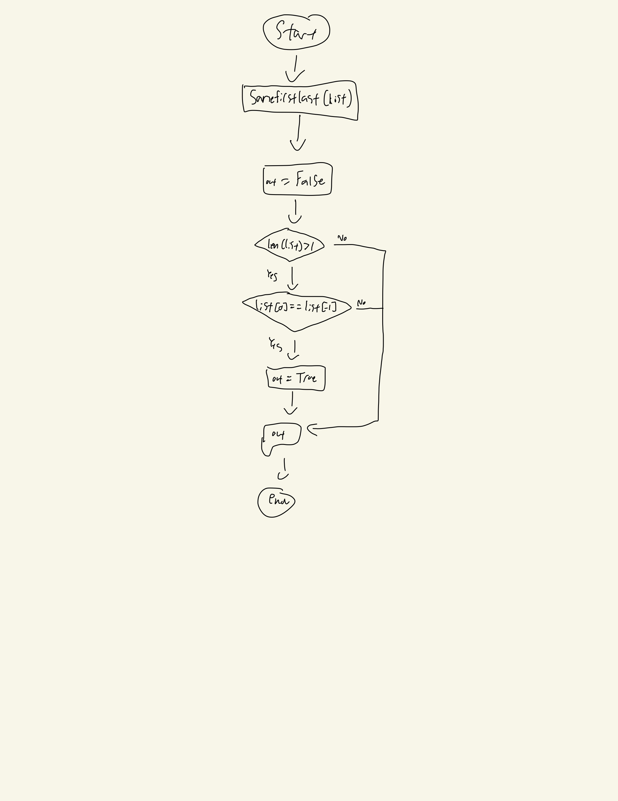

## Given an array of numbers, output TRUE if the array is length 1 or more, and the first element and the last element are equal. Otherwise output FALSE.
 
## Example:

## SameFirstLast([1, 2, 3]) → FALSE
## SameFirstLast([1, 2, 3, 1]) → TRUE
## SameFirstLast([1, 2, 1]) → TRUE



```.py
def samefirstlast(list):
    out="False"
    if len(list)>1:
        if list[0]==list[-1]:
            out="True"
    return out
a=samefirstlast([1,2,3,1])
print(a)
b=samefirstlast([1,2,3])
print(b)
```

## Output: 


## Flowchart:

