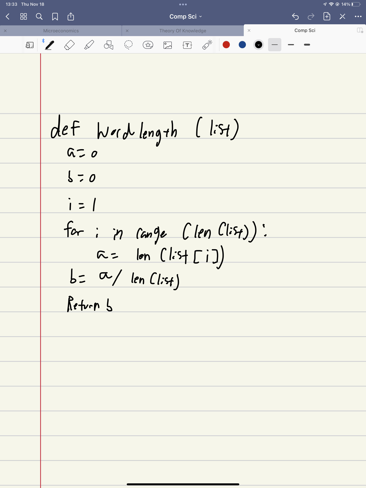
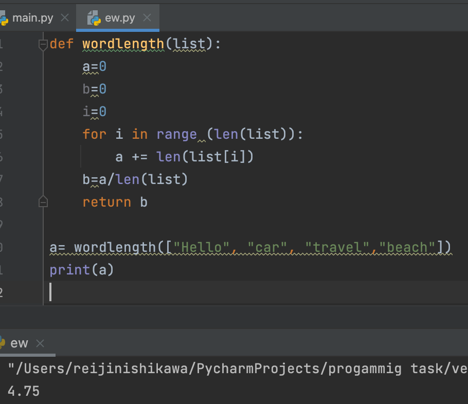
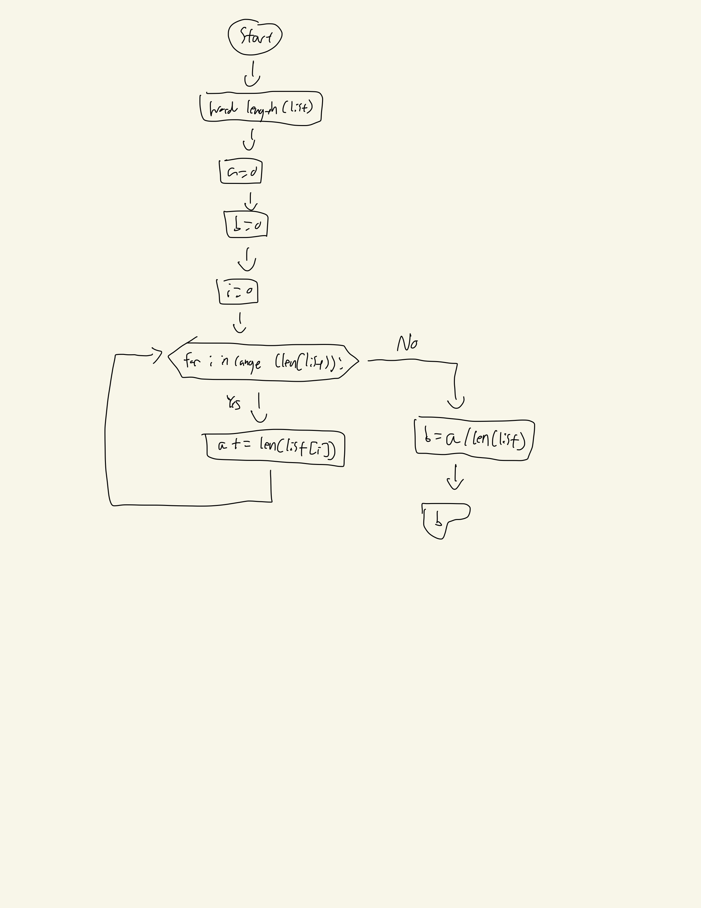

## Given an list of words, find the average word length.
 
## Example:

## wordlength(["home","car","travel","beach"])→4.5
## wordlength(["sun","sat","cut","can"]) → 3
## wordlength("police", "abacus"]) → 6




```.py
def wordlength(list):
    a=0
    b=0
    i=0
    for i in range (len(list)):
        a += len(list[i])
    b=a/len(list)
    return b

a= wordlength(["Hello", "car", "travel","beach"])
print(a)
```
## Output:


## Flowchart:

