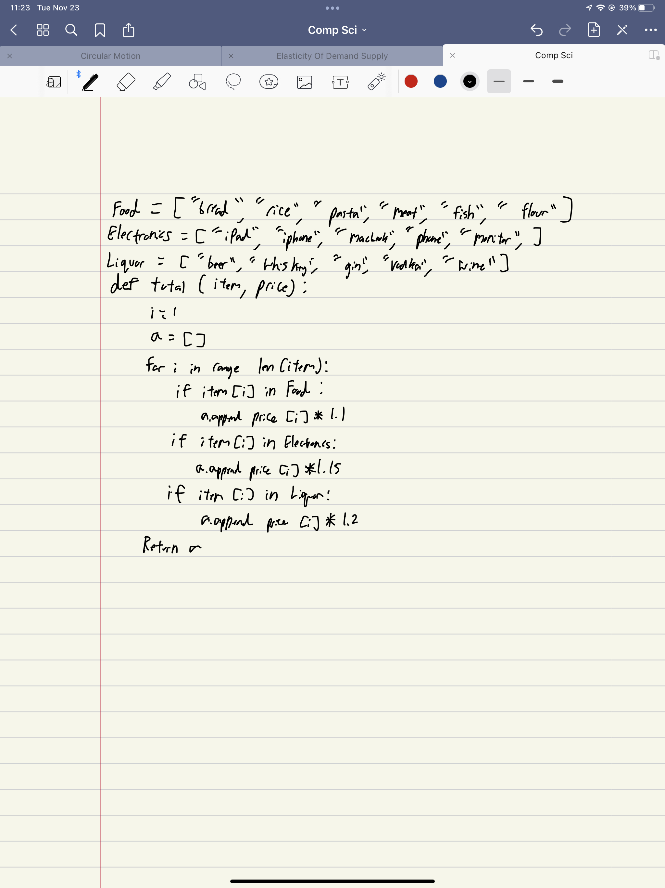

Given an array of food items and price, calculate the total price based on the table of tax categories below

Example:
total([“bread”,“beer”,“ipad”],[300, 800, 30000]) 
=> 35790  this comes from 300x1.1+800×1.2+30000×1.15


```.py
food = ["bread", "pasta", "rice"]
electronics = ["ipad","phone","computer"]
liquor = ["beer","vodka","gin"]

def total (item, price):
    i=1
    total=[]
    for i in range (len(item)):
        if item[i] in food:
            total=price[i]*1.1
        if item [i] in electronics:
            total=price[i]
        if item [i] in liquor:
            total=price[i]
        else:
            user=input(f"What category is {item[i]} food, electronics, liquor")
            user.append(item[i])
    return total
```
