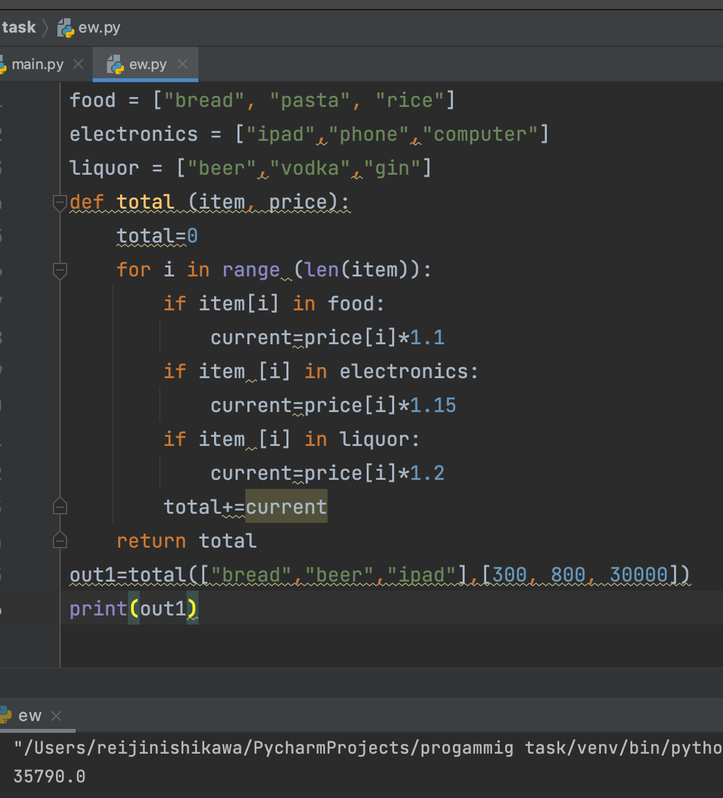
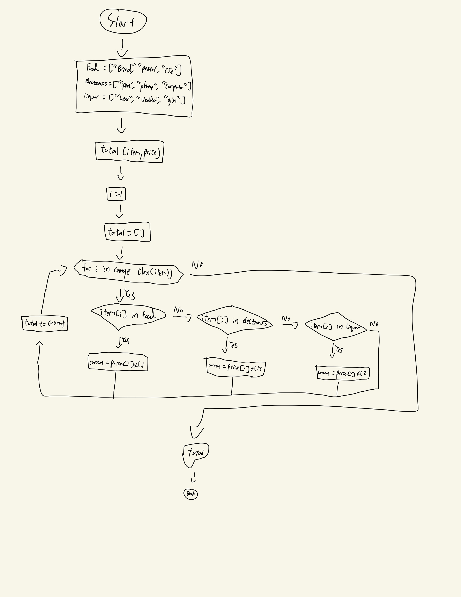

Given an array of food items and price, calculate the total price based on the table of tax categories below

Example:
total([“bread”,“beer”,“ipad”],[300, 800, 30000]) 
=> 35790  this comes from 300x1.1+800×1.2+30000×1.15


```.py
food = ["bread", "pasta", "rice"]
electronics = ["ipad","phone","computer"]
liquor = ["beer","vodka","gin"]
def total (item, price):
    total=0
    for i in range (len(item)):
        if item[i] in food:
            current=price[i]*1.1
        if item [i] in electronics:
            current=price[i]*1.15
        if item [i] in liquor:
            current=price[i]*1.2
        total+=current
    return total
out1=total(["bread","beer","ipad"],[300, 800, 30000])
print(out1)
```

## Output: 

## Flowchart:

