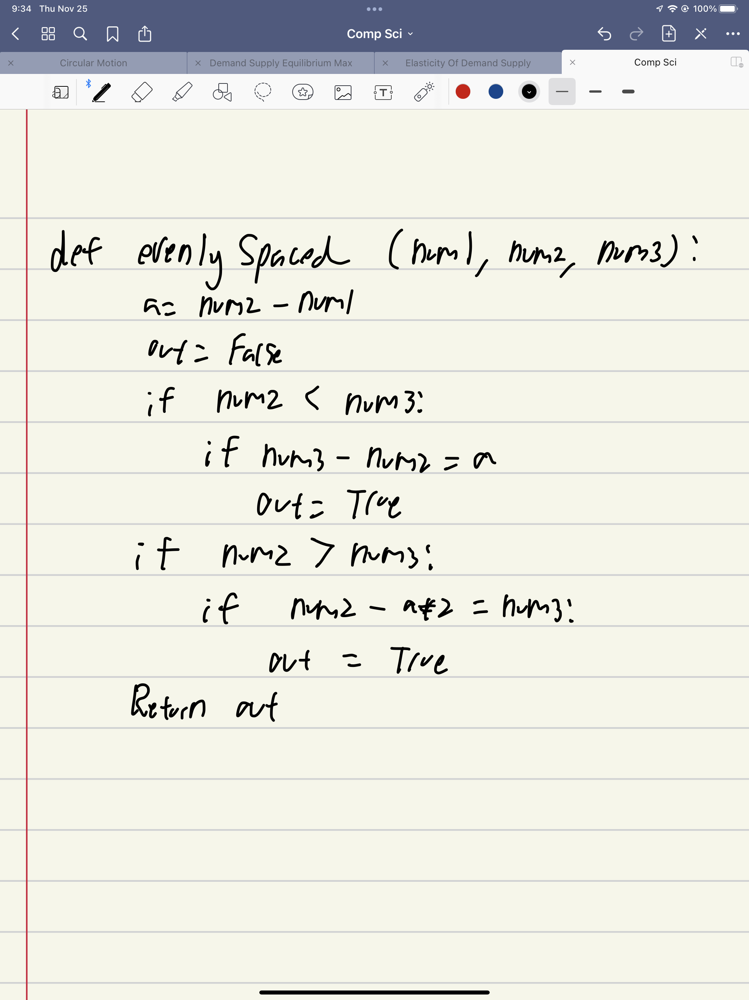
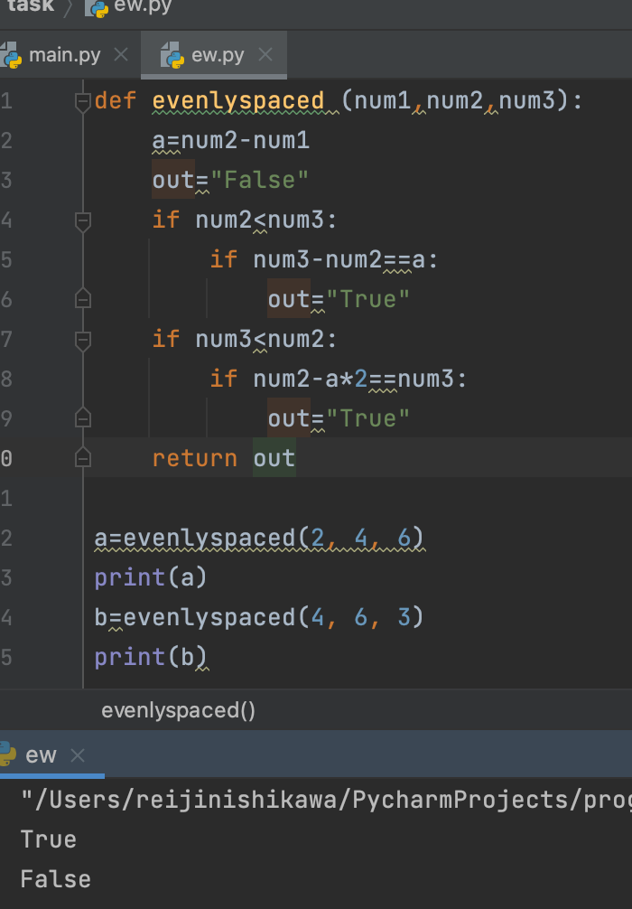
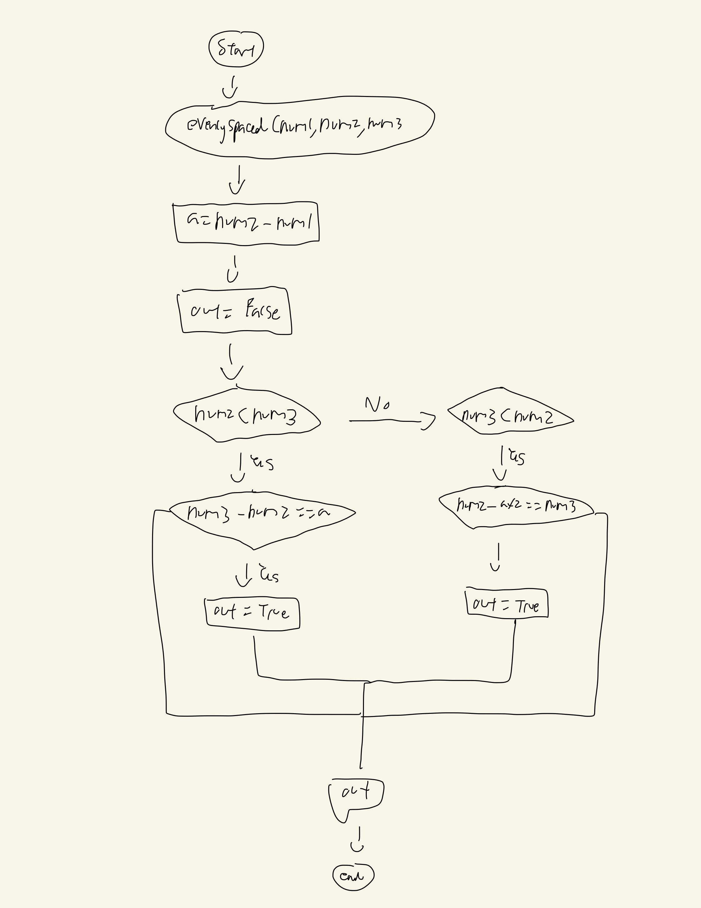

## Given three ints, a b c, one of them is small, one is medium and one is large. Return true if the three values are evenly spaced, so the difference between small and medium is the same as the difference between medium and large. 

## evenlySpaced(2, 4, 6) → true
## evenlySpaced(4, 6, 2) → true
## evenlySpaced(4, 6, 3) → false


```.py
def evenlyspaced (num1,num2,num3):
    a=num2-num1
    out="False"
    if num2<num3:
        if num3-num2==a:
            out="True"
    if num3<num2:
        if num2-a*2==num3:
            out="True"
    return out
```



