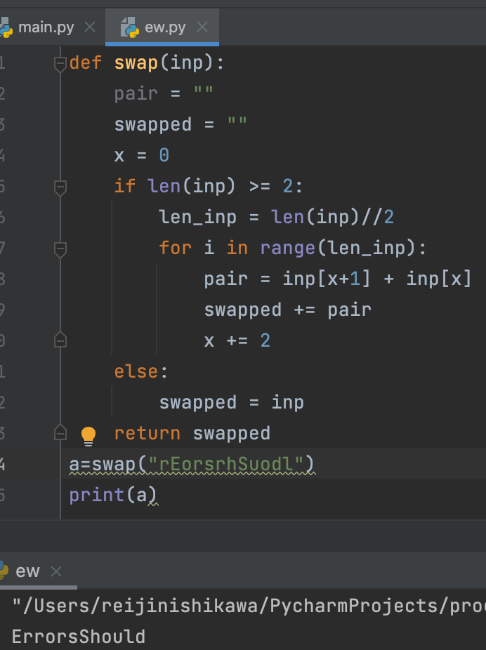
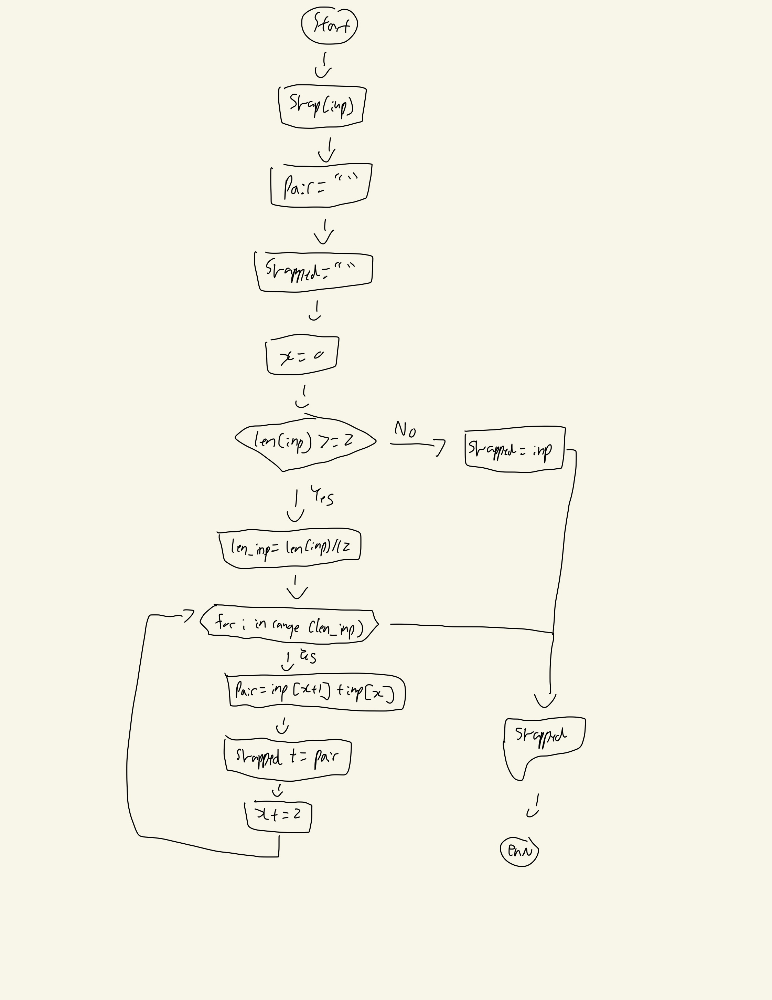

## For each pair of characters of an input String, swap every two characters. 


```.py
def Swap(inp):
    pair = ""
    swapped = ""
    x = 0
    if len(inp) >= 2:
        len_inp = len(inp)//2
        for i in range(len_inp):
            pair = inp[x+1] + inp[x]
            swapped += pair
            x += 2
    else:
        swapped = inp
    return swapped
 ```
## Output:


## Flowchart

