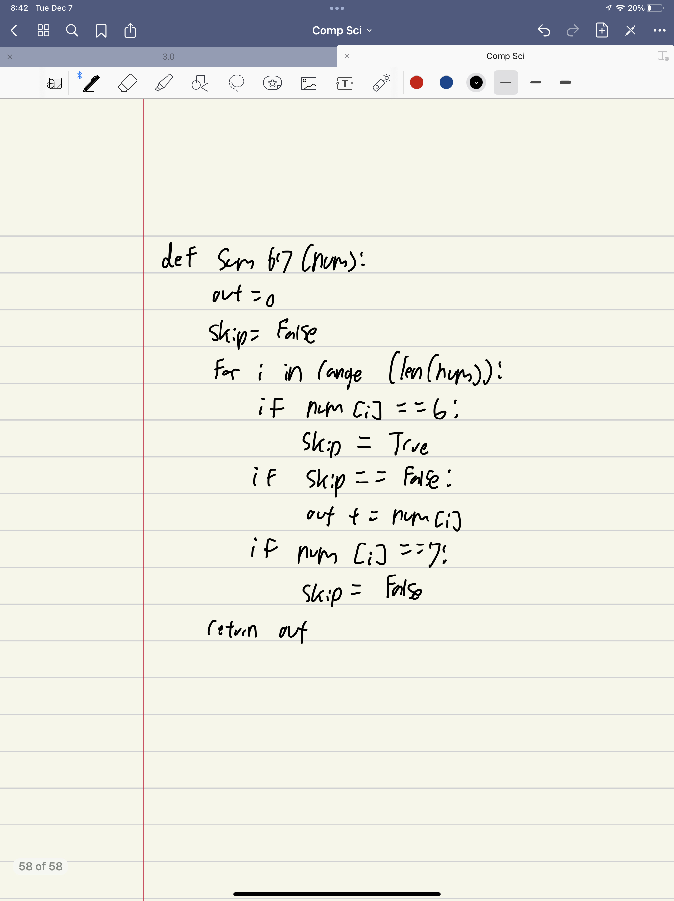
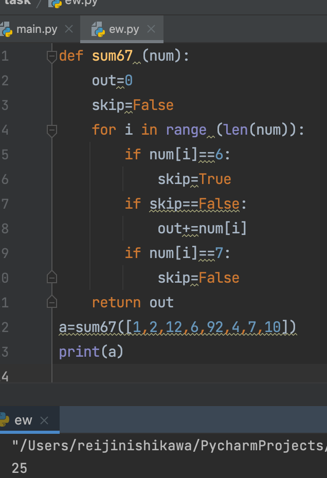
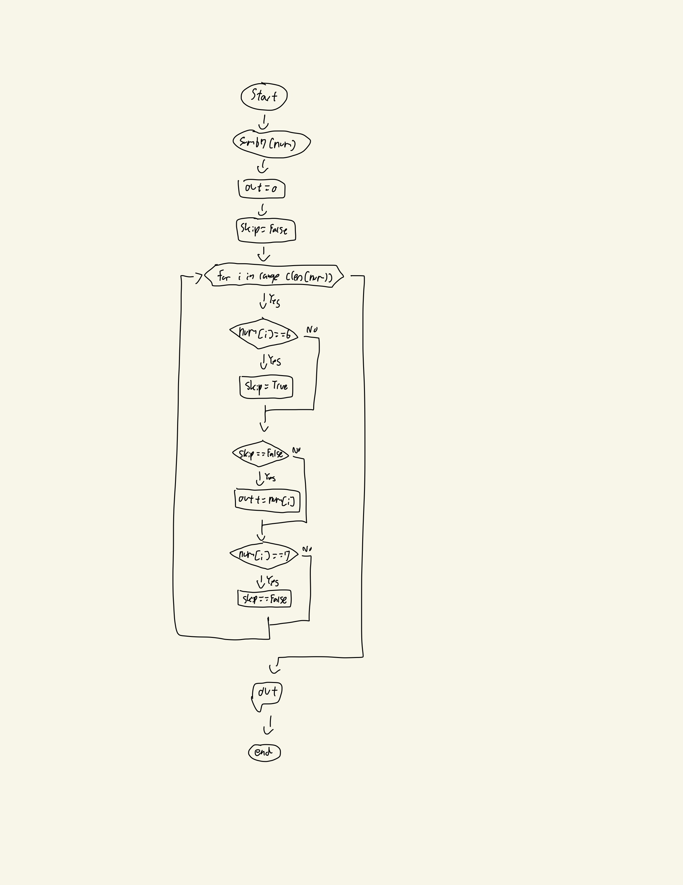

## Create a function that returns the sum of the numbers in the array, except ignore sections of numbers starting with a 6 and extending to the next 7 (every 6 will be followed by at least one 7). Return 0 for no numbers.



```.py
def sum67 (num):
    out=0
    skip=False
    for i in range (len(num)):
        if num[i]==6:
            skip=True
        if skip==False:
            out+=num[i]
        if num[i]==7:
            skip=False
    return out
a=sum67([1,2,12,6,92,4,7,10])
print(a)
```
## Output:


## Flowchart:

