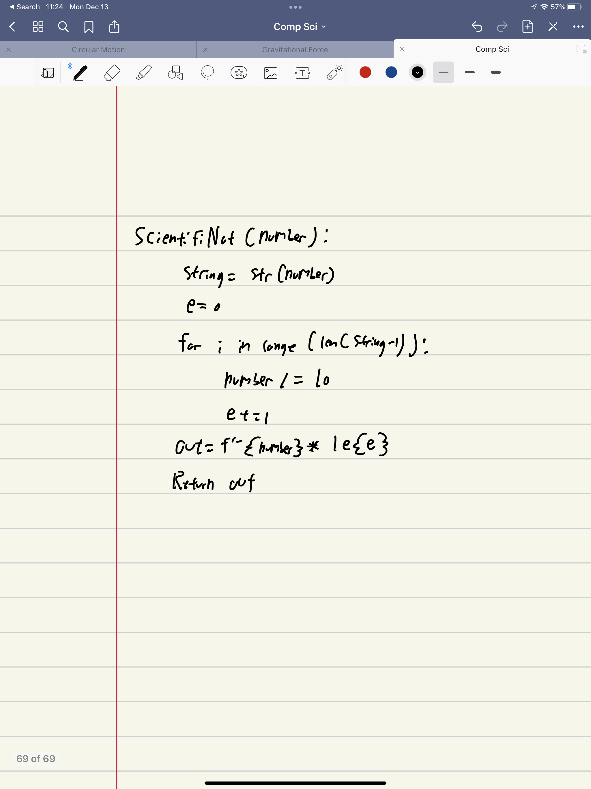
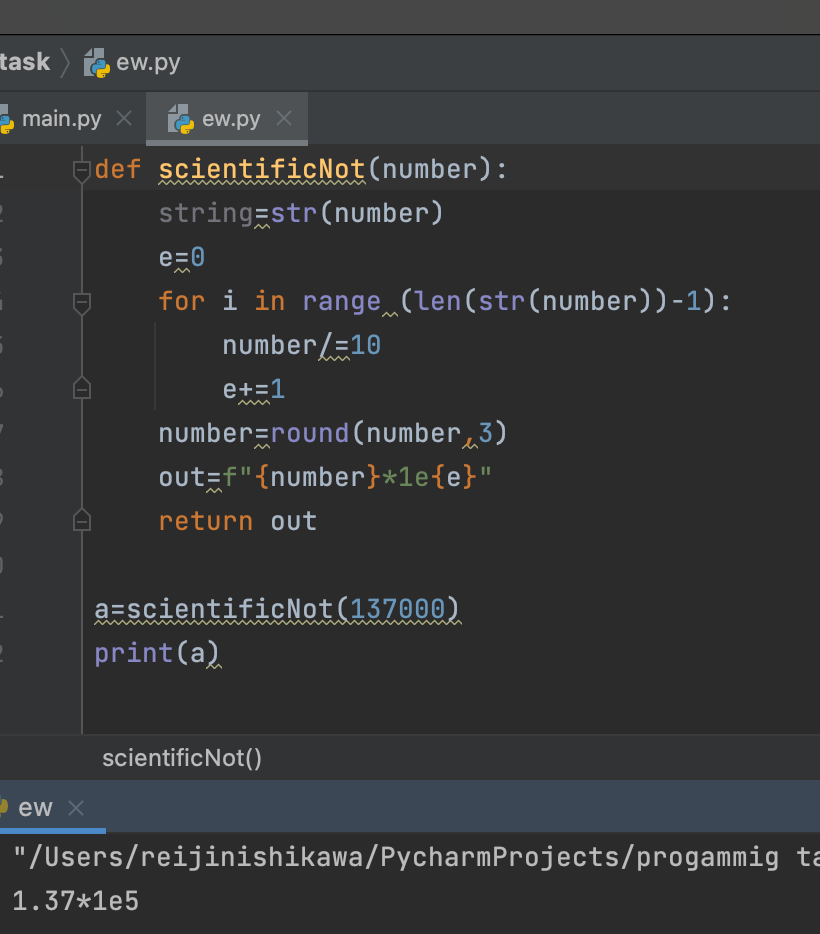

```.py
def scientificNot(number):
    string=str(number)
    e=0
    for i in range (len(str(number))-1):
        number/=10
        e+=1
    number=round(number,3)
    out=f"{number}*1e{e}"
    return out

a=scientificNot(137000)
print(a)
```




